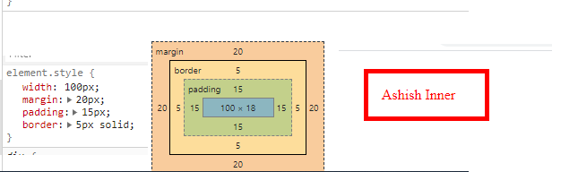
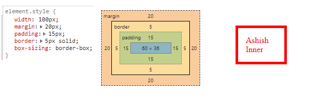

# CSS
A CSS rule consists of a selector and a declaration block. 

### Margin shorthand
```
margin: 25px 50px 75px;
top margin is 25px
right and left margins are 50px
bottom margin is 75px
```
```
margin: 25px 50px;
top and bottom margins are 25px
right and left margins are 50px
```
### Box model
`Content` - The content of the box, where text and images appear <br>
`Padding` - Clears an area around the content. The padding is transparent<br>
`Border` - A border that goes around the padding and content<br>
`Margin` - Clears an area outside the border. The margin is transparent<br>

 <br>
Content size width is 100px same as defined width

 <br>
Content size width is 60px with box-sizing: border-box; css<br> 

### CSS Property
`text-align` - The text-align property is used to set the horizontal alignment of a text.
When the text-align property is set to "justify", each line is stretched so that every line has equal width, and the left and right margins are straight (like in magazines and newspapers) <br>
`vertical-align` - The vertical-align property sets the vertical alignment of an element. <br>
`text-transform` - uppercase|lowercase |...<br>
`text-indent`: 50px; // spacing<br>
`position` : static | relative | fixed | absolute | sticky <br>
```
static:==>
Static positioned elements are not affected by the top, bottom, left, and right properties.
An element with position: static; is not positioned in any special way; it is always positioned according to the normal flow of the page:
```
```
relative:==>
An element with position: relative; is positioned relative to its normal position.
Setting the top, right, bottom, and left properties of a relatively-positioned element will cause it to be adjusted away from its normal position. Other content will not be adjusted to fit into any gap left by the element.
```
```
fixed:==>
An element with position: fixed; is positioned relative to the viewport, which means it always stays in the same place even if the page is scrolled. The top, right, bottom, and left properties are used to position the element.

A fixed element does not leave a gap in the page where it would normally have been located.

Notice the fixed element in the lower-right corner of the page. Here is the CSS that is used:
div.fixed {
  position: fixed;
  bottom: 0;
  right: 0;
  width: 300px;
  border: 3px solid #73AD21;
}
```
```
absolute:==>
An element with position: absolute; is positioned relative to the nearest positioned ancestor with position relative, absolute, fixed, sticky,(instead of positioned relative to the viewport, like fixed).

However; if an absolute positioned element has no positioned ancestors, it uses the document body, and moves along with page scrolling.

```
```
sticky:==>
An element with position: sticky; is positioned based on the user's scroll position.
A sticky element toggles between relative and fixed, depending on the scroll position. It is positioned relative until a given offset position is met in the viewport - then it "sticks" in place (like position:fixed).
```
`float` - The float property is used for positioning and formatting content e.g. let an image float left to the text in a container.
```diff
+ right | left | none | inherit
 
// add box to all div and it will divide every div into defined width 
+ .box {
+   float: left;
+   width: 33.33%; /* three boxes (use 25% for four, and 50% for two, etc) */
+   padding: 50px; /* if you want space between the images */
+ }
```
#### float vs absolute :
float will have interaction with other html nearby elements where as absolute position element only interaction with their nearest ancestors.

[`display`](https://www.w3schools.com/css/css_inline-block.asp) - inline-block | inline | block
```
inline-block:==>
Compared to display: inline, the major difference is that display: inline-block allows to set a width and height on the element.

Also, with display: inline-block, the top and bottom margins/paddings are respected, but with display: inline they are not.

Compared to display: block, the major difference is that display: inline-block does not add a line-break after the element, so the element can sit next to other elements.

The following example shows the different behavior of display: inline, display: inline-block and display: block:
```
[`clearfix`](https://www.w3schools.com/howto/howto_css_clearfix.asp) - 
If an element is taller than the element containing it, and it is floated, it will overflow outside of its container. You can use the "clearfix" hack to fix this (see example below).  
```
.clearfix {
  overflow: auto;
}
```
### Equal CSS

```
text-align: center;
// Equal 
img {
  display: block;
  margin-left: auto;
  margin-right: auto;
  width: 40%;
}

```
```
.right {
  float: right;
  width: 300px;
  border: 3px solid #73AD21;
  padding: 10px;
}
// Equal 
.right {
  position: absolute;
  right: 0px;
  width: 300px;
  border: 3px solid #73AD21;
  padding: 10px;
}
```
### Fallback Fonts
However, there are no 100% completely web safe fonts. There is always a chance that a font is not found or is not installed properly.
```font-family: Tahoma, Verdana, sans-serif;```

**Font shorthand** - ```font: font-style font-variant font-weight font-size(mandatory)/line-height font-family(mandatory)```

### CSS Selector
We can divide CSS selectors into five categories:

* Simple selectors (select elements based on name, id, class)
* Combinator selectors (select elements based on a specific relationship between them)
* Pseudo-class selectors (select elements based on a certain state)
* Pseudo-elements selectors (select and style a part of an element)
* Attribute selectors (select elements based on an attribute or attribute value)

`pseudo-class` - A pseudo-class is used to define a special state of an element.
```
syntax: 
selector:pseudo-class {
  property: value;
}
a:visited {
  color: #00FF00;
}
a.highlight:hover { // Pseudo-classes can be combined with CSS classes:
  color: #ff0000;
}
p i:first-child { // Match the first <i> element in all <p> elements
  color: blue;
}
p:first-child i { // Match all <i> elements in all first child <p> elements
  color: blue;
}
```
`Pseudo-Elements` - 
```
// syntax
selector::pseudo-element { 
  property: value;
}

p.intro::first-letter { // Pseudo-elements can be combined with CSS classes: 
  color: #ff0000;
  font-size: 200%;
}
p::first-letter {
  color: #ff0000;
  font-size: xx-large;
}
p::first-line {
  color: #0000ff;
  font-variant: small-caps;
}
h1::before {
  content: url(smiley.gif);
}
h1::after {
  content: url(smiley.gif);
}
::marker { //The ::marker pseudo-element selects the markers of list items
  color: red;
  font-size: 23px;
}
// The ::selection pseudo-element matches the portion of an element that is selected by a user.
// The following CSS properties can be applied to ::selection: color, background, cursor, and outline.
::selection { 
  color: red;
  background: yellow;
}
```
`CSS Attribute Selectors` - The [attribute] selector is used to select elements with a specified attribute.
```
a[target] {
  background-color: yellow;
}

```


<table class="w3-table-all notranslate">

<tbody>

<tr>

<th style="width:20%">Selector</th>

<th style="width:20%">Example</th>

<th>Example description</th>

</tr>

<tr>

<td>.class</td>

<td>.intro</td>

<td>Selects all elements with class="intro"</td>

</tr>

<tr>

<td>.class1.class2</td>

<td>.name1.name2</td>

<td>Selects all elements with both class name1 and name2 within its single class attribute</td>

</tr>

<tr>

<td>.class1 .class2</td>

<td>.test .heading { <br>
&nbsp; &nbsp; font-weight: bold; <br>
}</td>

<td>
It will point .headiung (child element) class inside .test (parent element) class <br />
heading will be class here of parent elements's class i.e. test <br />
(span class="test") (p class="heading")Something(/p)(/span)
</td>

</tr>

<tr>

<td>id</td>

<td>#firstname</td>

<td>Selects the element with id="firstname"</td>

</tr>

<tr>

<td>*</td>

<td>*</td>

<td>Selects all elements</td>

</tr>

<tr>

<td>element</td>

<td>p</td>

<td>Selects all <b>`p`</b> elements</td>

</tr>

<tr>

<td>element.class</td>

<td>p.intro</td>

<td>Selects all <b>`p`</b> elements with class="intro"</td>

</tr>

<tr>

<td>element,element</td>

<td>div, p</td>

<td>Selects all <b>`div`</b> elements and all `p` elements</td>

</tr>

<tr>

<td>element element</td>

<td>div p</td>

<td>Selects all <b>`p`</b> elements(either it comes in nested element like div->h1-span->p) inside <b>`div`</b> elements</td>

</tr>

<tr>

<td>element>element</td>

<td>div > p</td>

<td>Selects all <b>`p`</b> elements where the parent is a <b>`div`</b> element not nested <b>`p`</b> element</td>

</tr>

<tr>

<td>element+element</td>

<td>div + p</td>

<td>Selects the first <b>`p`</b> element that are placed immediately after <b>`div`</b> elements like brothers relation not child relation</td>

</tr>

<tr>

<td>element1~element2</td>

<td>p ~ ul</td>

<td>Selects every <b>'ul'</b> element that are preceded by a <b>'p'</b> element <br />
(p)The first paragraph or p element.(/p) <br />
(ul) <br />
 &nbsp;&nbsp;&nbsp;&nbsp;(li)Coffee will have this css(/li) <br />
 &nbsp;&nbsp;&nbsp;&nbsp;(li)Tea will have this css(/li) <br />
 &nbsp;&nbsp;&nbsp;&nbsp;(li)Milk will have this css(/li) <br />
(/ul) <br />
</td>

</tr>

<tr>

<td>[attribute]</td>

<td>[target]</td>

<td>Selects all elements with a target attribute</td>

</tr>

<tr>

<td>[attribute=value]</td>

<td>[target=_blank]</td>

<td>Selects all elements with target="_blank"</td>

</tr>

<tr>

<td>[attribute~=value]</td>

<td>[title~=flower]</td>

<td>Selects all elements with a title attribute containing the word "flower"</td>

</tr>

<tr>

<td>[attribute|=value]</td>

<td>[lang|=en]</td>

<td>Selects all elements with a lang attribute value starting with "en"</td>

</tr>

<tr>

<td>[attribute^=value]</td>

<td>a[href^="https"]</td>

<td>Selects every <b>'a'</b> element whose href attribute value begins with "https"</td>

</tr>

<tr>

<td>[attribute$=value]</td>

<td>a[href$=".pdf"]</td>

<td>Selects every <b>'a'</b> element whose href attribute value ends with ".pdf"</td>

</tr>

<tr>

<td>[attribute*=value]</td>

<td>a[href*="w3schools"]</td>

<td>Selects every <b>'a'</b> element whose href attribute value contains the substring "w3schools"</td>

</tr>

<tr>

<td>:last-child</td>

<td>p:last-child</td>

<td>Selects every <b>'p'</b> element that is the last child of its parent</td>

<tr>

<td>:not(selector)</td>

<td>:not(p)</td>

<td>Selects every element that is not a <b>'p'</b> element</td>

</tr>

<tr>

<td>:only-of-type</td>

<td>p:only-of-type</td>

<td>Selects every <b>'p'</b> element that is the only <b>'p'</b> element of its parent</td>

</tr>

<tr>

<td>:only-child</td>

<td>p:only-child</td>

<td>Selects every <b>'p'</b> element that is the only child of its parent</td>

</tr>

<tr>

<td>:root</td>

<td>:root</td>

<td>Selects the document's root element</td>

</tr>

<tr>

<td>::selection</td>

<td>::selection</td>

<td>Selects the portion of an element that is selected by a user</td>

</tr>


</tbody>

</table>

### Navbar - sample CSS for navbar
```
ul {
  list-style-type: none;
  margin: 0;
  padding: 0;
  
}
li {
  float: left;
}
a {
  display: inline-block;
  padding: 8px;
  background-color: #dddddd;
}

// HTML
<ul>
  <li><a href="#home">Home</a></li>
  <li><a href="#news">News</a></li>
  <li><a href="#contact">Contact</a></li>
  <li><a href="#about">About</a></li>
</ul>


```

### CSS Functions
`attr()` - Returns the value of an attribute of the selected element<br>
`calc()` - Allows you to perform calculations to determine CSS property values<br>
`rgb()` - Defines colors using the Red-Green-Blue model (RGB)<br>
`var()` - Inserts the value of a custom property <br>
and much more	<br>

### CSS Aural Reference
Aural style sheets use a combination of speech synthesis and sound effects to make the user listen to information, instead of reading information. specially for blind people

### CSS Flex
Flexbox provide us to render block elements into various direction with all possible ways. Before Flexbox layout module, there were four modes: 
* Block, for sections in a webpage
* Inline, for text
* Table, for two-dimensional table data
* Positioned, for explicit position of an element <br>

The Flexible Box Layout Module, makes it easier to design flexible responsive layout structure without using float or positioning.

To achieve flex.. first we need to set display property as flex

**The flex container properties are:**<br>
`flex-direction` - Specifies the direction of the flexible items inside a flex container
```diff
+ column | column-reverse | row | row-reverse
```
`flex-wrap` - Specifies whether the flex items should wrap or not, if there is not enough room for them on one flex line
```diff
+ wrap | nowrap | wrap-reverse
```
`flex-flow` - A shorthand property for flex-direction and flex-wrap | ex: row wrap

`justify-content` - Horizontally aligns the flex items when the items do not use all available space on the main-axis 
```diff
+ center | flex-start | flex-end | space-around | space-between
``` 
[`align-items`](https://www.w3schools.com/cssref/playit.asp?filename=playcss_align-items&preval=stretch) - Vertically aligns the flex items when the items do not use all available space on the cross-axis, here block height will change
```diff
+ center | flex-start | flex-end | stretch | baseline
``` 
[`align-content`](https://www.w3schools.com/cssref/playit.asp?filename=playcss_align-content&preval=stretch) - Modifies the behavior of the flex-wrap property. It is similar to align-items, but instead of aligning flex items, it aligns flex lines and flex lines means block which we are using in flex container
 ```diff
+ space-between | space-around | stretch | center | flex-start | flex-end
``` 
[**Flex Items - The flex Items properties are:**](https://www.w3schools.com/css/css3_flexbox_items.asp)<br>
`align-self` - Specifies the alignment for a flex item (overrides the flex container's align-items property)
```diff
+  <div style="align-self: center">3</div>
```
`flex` - A shorthand property for the flex-grow, flex-shrink, and the flex-basis properties
```diff
+ <div style="flex: 0 0 200px">3</div>
```
`flex-basis` - Specifies the initial length of a flex item ex: ```<div style="flex-basis: 200px">3</div>```

`flex-grow` - Specifies how much a flex item will grow relative to the rest of the flex items inside the same container
```diff
+ <div class="flex-container">
+   <div style="flex-grow: 1">1</div>
+   <div style="flex-grow: 1">2</div>
+   <div style="flex-grow: 8">3</div>
+ </div>
``` 
`flex-shrink` = Specifies how much a flex item will shrink relative to the rest of the flex items inside the same container
```diff
// Do not let the third flex item shrink as much as the other flex items:
+ <div class="flex-container">
+   <div>1</div>
+   <div>3</div>
+   <div style="flex-shrink: 0">4</div>
+   <div>5</div>  
+ </div>
``` 
`order` - Specifies the order of the flex items inside the same container 
```diff
+ <div class="flex-container">
+   <div style="order: 3">1</div>
+   <div style="order: 4">2</div>
+   <div style="order: 1">3</div> 
+   <div style="order: 1">4</div>
+ </div>
``` 

###CSS Entities
If you use CSS to display any of these characters in HTML, you can use the CSS entity found in the table below.
```
<style>
h2:after {
  content: ' \00A7';
}
</style>
```
### CSS Image Sprites
An image sprite is a collection of images put into a single image.
A web page with many images can take a long time to load and generates multiple server requests.
Using image sprites will reduce the number of server requests and save bandwidth.
```
#home {
  left: 0px;
  width: 46px;
  background: url('img_navsprites.gif') 0 0;
}

#prev {
  left: 63px;
  width: 43px;
  background: url('img_navsprites.gif') -47px 0;
}

#next {
  left: 129px;
  width: 43px;
  background: url('img_navsprites.gif') -91px 0;
}

```

### [CSS Units](https://www.w3schools.com/css/css_units.asp)
There are two types of length units: absolute and relative.
`absolute` - The absolute length units are fixed and a length expressed in any of these will appear as exactly that size. <br>
Absolute length units are not recommended for use on screen, because screen sizes vary so much. However, they can be used if the output medium is known, such as for print layout.
`relative` - Relative length units specify a length relative to another length property. Relative length units scales better between different rendering mediums.
em	Relative to the font-size of the element (2em means 2 times the size of the current font)<br>
**vw**	Relative to 1% of the width of the viewport* <br>
**vh**	Relative to 1% of the height of the viewport* <br>
**%**	Relative to the parent element<br>

Tip: The em and rem units are practical in creating perfectly scalable layout!
* Viewport = the browser window size. If the viewport is 50cm wide, 1vw = 0.5cm.

### CSS Specificity
If there are two or more conflicting CSS rules that point to the same element, the browser follows some rules to determine which one is most specific and therefore wins out.
Specificity Hierarchy
Every selector has its place in the specificity hierarchy. There are four categories which define the specificity level of a selector:

`Inline styles` - **1000** An inline style is attached directly to the element to be styled. Example: h1 style="color: #ffffff;".

`IDs` - **100** An ID is a unique identifier for the page elements, such as #navbar.

`Classes, attributes and pseudo-classes` - **10** This category includes .classes, [attributes] and pseudo-classes such as :hover, :focus etc.

`Elements and pseudo-elements` - **1** This category includes element names and pseudo-elements, such as h1, div, :before and :after.

```
// Start at 0, add 1000 for style attribute, add 100 for each ID, add 10 for each attribute, class or pseudo-class, add 1 for each element name or pseudo-element.'

A: h1
B: #content h1
C: <div id="content"><h1 style="color: #ffffff">Heading</h1></div>

The specificity of A is 1 (one element)
The specificity of B is 101 (one ID reference and one element)
The specificity of C is 1000 (inline styling)

Since 1 < 101 < 1000, the third rule (C) has a greater level of specificity, and therefore will be applied.

Equal specificity: the latest rule counts -
ID selectors have a higher specificity than attribute selectors

```

### Animation
```
<style> 
div {
  width: 100px;
  height: 100px;
  background-color: red;
  animation-name: example;
  animation-duration: 4s;
}

@keyframes example {
  from {background-color: red;}
  to {background-color: yellow;}
}
</style>

```

### var in css
First of all: CSS variables can have a global or local scope.
<br>
Global variables can be accessed/used through the entire document, while local variables can be used only inside the selector where it is declared.
<br>
To create a variable with global scope, declare it inside the :root selector. The :root selector matches the document's root element.
<br>
To create a variable with local scope, declare it inside the selector that is going to use it.
<br>
The following example is equal to the example above, but here we use the var() function.
<br>
First, we declare two global variables (--blue and --white). Then, we use the var() function to insert the value of the variables later in the style sheet:
<br>
```
:root {
  --blue: #1e90ff;
  --white: #ffffff;
}

body { background-color: var(--blue); }

h2 { border-bottom: 2px solid var(--blue); }

.container {
  color: var(--blue);
  background-color: var(--white);
  padding: 15px;
}

button {
  background-color: var(--white);
  color: var(--blue);
  border: 1px solid var(--blue);
  padding: 5px;
}

```

### Media Query 
```
@media only screen and (max-width: 768px) {
  /* For mobile phones: */
  [class*="col-"] {
    width: 100%;
  }
}
```

### [CSS Modules](https://css-tricks.com/css-modules-part-1-need/)
Using CSS modules we can use css specific to component and it will used with dot operator
```
import buttons from "./buttons.css";
import padding from "./padding.css";

element.innerHTML = `<div class="${buttons.red} ${padding.large}">`;
```
### [Compose](https://css-tricks.com/css-modules-part-1-need/)
1. Using compose we can use css of other class
2. Using compose we can define inline css as well (Not sure)
```
.element {
  composes: dark-red from "./colors.css";
  font-size: 30px;
  line-height: 1.2;
}
```


