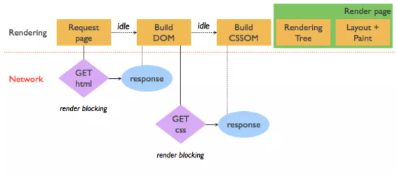

# JAVAScript

##### Table of Contents
[Hoisting](#user-content-hoisting)<br>
[Higher Order Functions](#user-content-higher-order-functions)<br>
[Currying](#user-content-currying)<br>
[Arrow functions vs Regular function](#arrow-functions-vs-regular-function)<br>
[var, const and let](#var-const-and-let)<br>
[Promises](#promises--it-has-four-states---pending-rejected-settled)<br>
[Functions vs Classes](#functions-vs-classes)<br>
[Genrator Functions](#genrator-functions)<br>
[WeakSet](#set-vs-weakset)<br>
[WeakMap](#map-vs-weakmap)<br>
[Object Destructuring](#object-destructuring)<br>
[For of and For-in](#for-of-and-for-in)<br>
[call, apply, bind()](#call-apply-bind)<br>
[Coercion](#coercion)<br>
[intersectionobserver](#intersectionobserver)<br>
[ES6 | ES2020 Feature](#es6--es2020-feature)<br>
[Best Blogs](#best-blogs)<br>


## [2021](https://www.interviewbit.com/javascript-interview-questions/)
### SSNNBBU
```
// dataType(typeOf)
String(string), Symbol(symbol), Number(number), null(Object), Boolean(bool), Undefined(undefined),
BigInt : end with n
```


### typeOf
```javascript
typeof undefined // Returns "undefined"
typeof null // Returns "object" (kind of a bug in JavaScript)
typeof Null // Returns "undefined" (as Null is undefined variable here)
typeof [] // Returns "object"
typeof {} // Returns "object"
```

### isNAN
```javascript
isNaN("Hello")  // Returns true <br>
isNaN(345)   // Returns false <br>
isNaN('1')  // Returns false, since '1' is converted to Number type which results in 0 ( a number)  <br>
isNaN(true) // Returns false, since true converted to Number type results in 1 ( a number) <br>
isNaN(false) // Returns false <br>
isNaN(undefined) // Returns true <br>
```

### Primitive vs NonPrimitive data types
Primitive data types can store only a single value. To store multiple and complex values, non-primitive data types are used <br>
Primitive values are also immutable. They can’t be changed. Of course, a variable with a primitive assigned can be reassigned. For example, when you write the code let x = 1; x++;, you've reassigned the variable x. But, you haven't mutated the primitive numeric value of 1. <br>
`Object` - Used to store collection of data. <br>
> Note :  It is important to remember that any data type that is not primitive data type, is of Object type in javascript. <br>

### Hoisting
Hoisting is a default behaviour of javascript where all the variable(with var) and function declarations are moved on top. <br>
**Note - Variable initializations are not hoisted, only variable declarations are hoisted** <br>
**Note - To avoid hoisting, you can run javascript in strict mode by using “use strict” on top of the code**

### Passed by value and Passed by reference
In JavaScript, primitive data types are passed by value and non-primitive data types are passed by reference

### Immediately Invoked Function
An Immediately Invoked Function ( known as IIFE and pronounced as IIFY) is a function that runs as soon as it is defined.
```javascript
(function(){          			(() => { // arrow function
  // Do something;					// Do something;
})();						      })();
```

### Higher Order Functions
Functions that operate on other functions, either by taking them as arguments or by returning them, are called higher-order functions.

### Currying
Currying is an advanced technique to transform a function of arguments n, to n functions of one or less arguments.
```javascript
var b = ()=> {
	return () => {
		return () => 5;
	}
}
b()()();
```

### [Arrow functions vs Regular function](https://dmitripavlutin.com/differences-between-arrow-and-regular-functions/)
```diff
var obj1 = {
  valueOfThis: function(){
    return this;
  }
}
var obj2 = {
  valueOfThis: ()=>{
    return this;
  }
}

obj1.valueOfThis(); // Will return the object obj1
obj2.valueOfThis(); // Will return window/global object as there is no binding of this keyword
++ Note -- The this keyword inside an arrow function, does not refer to the object calling it. It rather inherits its value from the parent scope which is the window object in this case.
Major Points :
1. this value
2. Constructor
3. Syntax change like Implicit return
In Regular function :
1. this value inside a regular function is dynamic and depends on the invocation. But this inside the arrow function is bound lexically and equals to this of the outer function.

```

### this scope
```
var length = 10;
function fn(){
    console.log('Ashish',this.length);
}

var obj = {
    length: 5,
    method: function(fn){
        fn();
        arguments[0]();
        console.log('inner scope',this.length);
    }
}

obj.method(fn, 1);

// 10
// 2 // this is the length of arguments, if we use another variable then undefined will print
// inner scope 5
```

### var, const and let
<table>
        <tbody>
          <tr>
            <td style="width: 279.5px;">keyword</td>
            <td style="width: 279.5px;">const</td>
            <td style="width: 279.5px;">let</td>
            <td style="width: 279.5px;">var</td>
          </tr>
          <tr style="background: rgb(239, 205, 195);">
            <td style="width: 279.5px;">global scope</td>
            <td style="width: 279.5px;"> no </td>
            <td style="width: 279.5px;"> no </td>
            <td style="width: 279.5px;"> yes </td>
          </tr>
          <tr style="background: rgb(239, 205, 195);">
            <td style="width: 279.5px;">function scope</td>
            <td style="width: 279.5px;"> yes </td>
            <td style="width: 279.5px;"> yes </td>
            <td style="width: 279.5px;"> yes </td>
          </tr>
          <tr style="background: rgb(239, 205, 195);">
            <td style="width: 279.5px;">block scope</td>
            <td style="width: 279.5px;"> yes </td>
            <td style="width: 279.5px;"> yes </td>
            <td style="width: 279.5px;"> no </td>
          </tr>
          <tr style="background: rgb(239, 205, 195);">
            <td style="width: 279.5px;">can be reassigned</td>
            <td style="width: 279.5px;"> no </td>
            <td style="width: 279.5px;"> yes </td>
            <td style="width: 279.5px;"> yes </td>
          </tr>
        </tbody>
      </table>

1. var always have the global scope means it will be on global scope even if it is in block scope. and let will not have the global scope.
2. In **`FUNCTIONAL SCOPE`** let and var both are equal. means both will not have access on global object. and outer variable will have different value as compare to inner. none of the vairable get overwrite and none reference error will come.
3. **BLOCK SCOPE** : In block scope var will have same rule means no matter var is outside or inside.
4. if var is out side then let can have same variable name because here let can have own block scope but not allowed vice versa because var will move on top using hoisting.<br>
   **Note : if let is defined like let a; and in side block var a; again then there will be error like reference already defined because var will move outside the block scope** <br>
6. variable with let keyword will always be binded with block scope.
7. Variables with the const keyword behave exactly like a variable declared with the let keyword with only one difference, any variable declared with the const keyword cannot be reassigned.

```
var variable1 = 23;
let variable2 = 89;

function catchValues(){
  console.log(variable1);
  console.log(variable2);
// Both the variables can be accessed anywhere since they are declared in the global scope
}
window.variable1; // Returns the value 23
window.variable2; // Returns undefined
```

Note (same copied in more depth):
* var : have only functional scope.. in case if variable declared with var  keyword outside the functional scope, will have windows/global scope. Therefore, they can be accessed using window.variableName
* Whereas, the variables declared with the let keyword are not added to the global object, therefore, trying to access such variables using window.variableName results in an error.
* Variables declared in a functional/local scope using var and let keywords behave exactly the same, meaning , they cannot be accessed from outside of the scope.
* Variables declared with var keyword do not have block scope. It means a variable declared in block scope {} with the var keyword is the same as declaring the variable in the global scope.
* Variables declared with let keyword inside the block scope cannot be accessed from outside of the block. and in this case let binded with that block scope

* Variables with the const keyword behave exactly like a variable declared with the let keyword with only one difference, any variable declared with the const keyword cannot be reassigned.

##### Various Examples :
```javascript
let s = 5;
(function test(){
    var s = 6; /output=>6/
})();
/output=>5/

var x = 5;
(function test(){
    var x = 6; /output=>6/
})();
/output=>5/

var k = 5;
(function test(){
    let k = 6; /output=>6/
})();
/output=>5/

var a = 5;
{
    let a = 6; /output=>6/
}
/output=>5/

let b = 5;
{
    var b = 6; /Uncaught SyntaxError: Identifier 'b' has already been declared/
    console.log(b);
}
console.log(b);

let c = 5;
var d = 6;
{
    var d = 7;
    console.log(c); //  5
    console.log(d); // 7
}
console.log(c); // 5
console.log(d); // 7

let x = 1;
if (x === 1) {
  let x = 2;
  console.log(x);
  // expected output: 2
}
console.log(x);
// expected output: 1
```

```javascript
function varTest() {
  var x = 1;
  {
    var x = 2;  // same variable!
    console.log(x);  // 2
  }
  console.log(x);  // 2
}

function letTest() {
  let x = 1;
  {
    let x = 2;  // different variable
    console.log(x);  // 2
  }
  console.log(x);  // 1
}
```

```javascript
var x = 'global';
let y = 'global';
console.log(this.x); // "global"
console.log(this.y); // undefined
```

```diff
let x = 1;
switch(x) {
  case 0:
    let foo;
    break;

  case 1:
    let foo; // SyntaxError for redeclaration.
    break;
}

+// works fine as we created new block scope
let x = 1;

switch(x) {
  case 0: {
    let foo;
    break;
  }
  case 1: {
    let foo;
    break;
  }
}
```

```javascript
function test(){
   var foo = 33;
   if(foo) {
      let foo = (foo + 55); // ReferenceError
   }
}
test();
```

```javascript
var a = 1;
var b = 2;

if (a === 1) {
  var a = 11; // the scope is global
  let b = 22; // the scope is inside the if-block

  console.log(a);  // 11
  console.log(b);  // 22
}

console.log(a); // 11
console.log(b); // 2
```
```javascript
let x = 1;

{
  var x = 2; // SyntaxError for re-declaration
}

// below will work fine as both have const
const c = 1;
{
  const c = 2;
}
console.log(c); // logs 1 and does not throw SyntaxError...
```

### Promises : it has four states -> Pending, Rejected, Settled
```javascript
function resolveAfter2Seconds() {
  return new Promise(resolve => {
    setTimeout(() => {
      resolve('resolved');
    }, 2000);
  });
}

async function asyncCall() {
  console.log('calling');
  const result = await resolveAfter2Seconds();
  console.log(result);
  // expected output: "resolved"
}

asyncCall();
```

### Functions vs Classes
* Unlike functions, classes are not hoisted. A class cannot be used before it is declared.
* A class can inherit properties and methods from other classes by using the extend keyword.
* All the syntaxes inside the class must follow the strict mode(‘use strict’) of javascript. Error will be thrown if the strict mode rules are not followed.

### Genrator Functions
* They can be stopped midway and then continue from where it had stopped.
* In normal functions, we use the return keyword to return a value and as soon as the return statement gets executed, the function execution stops:
* In the case of generator functions, when called, they do not execute the code, instead they return a generator object . This generator object handles the execution.
* The generator object consists of a method called next() , this method when called, executes the code until the nearest yield statement, and returns the yield value.

```javascript
function* iteratorFunc() {
  let count = 0;
  for (let i = 0; i < 2; i++) {
      count++;
      yield i;
  }
  return count;
}

let iterator = iteratorFunc();
console.log(iterator.next()); // {value:0,done:false}
console.log(iterator.next()); // {value:1,done:false}
console.log(iterator.next()); // {value:2,done:true}
```
```
function* generatorWithRejectedPromises() {
  try {
    yield 0;
    yield 1;
    yield Promise.resolve(2);
    yield Promise.reject(3);
    yield 4;
    throw 5;
  } finally {
    console.log('called finally')
  }
}

(async function() {
  try {
    for await (let num of generatorWithRejectedPromises()) {
      console.log(num);
    }
  } catch (e) {
    console.log('caught', e)
  }
})();
// 0
// 1
// 2
// caught 3

// compare with for-of loop:

try {
  for (let numOrPromise of generatorWithRejectedPromises()) {
    console.log(numOrPromise);
  }
} catch (e) {
  console.log('caught', e)
}
// 0
// 1
// Promise { 2 }
// Promise { <rejected> 3 }
// 4
// caught 5
// called finally
```

### Set VS WeakSet
* Weakset contains only objects and no other type.
* An object inside the weakset is referenced weakly. This means, if the object inside the weakset does not have a reference, it will be garbage collected.
* Unlike Set, WeakSet only has three methods, add() , delete() and has().

```javascript
const newSet = new Set([4, 5, 6, 7]);
console.log(newSet);// Outputs Set {4,5,6,7}
const newSet2 = new WeakSet([3, 4, 5]); //Throws an error

let obj1 = {message:"Hello world"};
const newSet3 = new WeakSet([obj1]);
console.log(newSet3.has(obj1)); // true
```

### Map vs WeakMap
* The keys and values in weakmap should always be an object.
* If there are no references to the object, the object will be garbage collected.

```javascript
const map1 = new Map();
map1.set('Value', 1);

const map2 = new WeakMap();
map2.set('Value', 2.3); // Throws an error

let obj = {name:"Vivek"};
const map3 = new WeakMap();
map3.set(obj, {age:23});
```

### Object Destructuring & Rest Operator

```javascript
const classDetails = {
  strength: 78,
  benches: 39,
  blackBoard:1
}

const {strength:classStrength, benches:classBenches,blackBoard:classBlackBoard} = classDetails;

console.log(classStrength); // Outputs 78
console.log(classBenches); // Outputs 39
console.log(classBlackBoard); // Outputs 1
```
```javascript
const arr = [1, 2, 3, 4];
const [first,second,third,fourth, ...rest] = arr;

// in rest variable we will keep all the remainig array item

console.log(first); // Outputs 1
console.log(second); // Outputs 2
console.log(third); // Outputs 3
console.log(fourth); // Outputs 4
```


**Note : [] == false is evaluated in iterative approach. At first, if one side of == is primitive and the other is object, it converts oject to primitive af first, then converts both sides to Number if both side are not string(string comparison is used both sides are string). so the comparison is iterated like.**
[] == false => ''== false->0==0 => true
```
let a = 0;
let b = false;
console.log((a == b));  // true
console.log((a === b)); // false
```

```diff
function func2(){
	for(var i = 0; i < 3; i++){
		setTimeout(()=> console.log(i),2000);
	}
}

func2();
+// 3 3 3

function func2(){
	for(let i = 0; i < 3; i++){
		setTimeout(()=> console.log(i),2000);
	}
}

func2();
+// 1 2 3 as let have bydefault binding with block scope
```

### For of and For-in
`For-in` - For in loop is using for iterable object and in simple we can say it will iterate over keys <br>
`For-of` - For of loop is using for array of any object and in simple we can say it will iterate over values <br>
Note - if we run for in on array of primitives data types then it will return the index of item.

### call, apply, bind()
call() method takes arguments separately whereas, apply() method takes arguments as an array.

## [Coercion](https://www.freecodecamp.org/news/js-type-coercion-explained-27ba3d9a2839/)
Implicit type coercion in javascript is automatic conversion of value from one data type to another <br>
The ‘==’ operator, converts both the operands to the same type and then compares them. Object.is( we can use if we don't want coercion) <br>
**Note - The same ‘ + ‘ operator when used to add two strings, outputs the concatenated string**  <br>
**Note - With ‘ - ‘ operator, a string is converted to a number and then subtraction takes place**
#### Boolean Coercion
**Note** - All values except 0, 0n, -0, “”, null, undefined and NaN are truthy values.


```javascript
  console.log("1" + 1); // 11 <br>
  console.log("A" - 1); // NaN <br>
  console.log(2 + "-2" + "2"); // 2-22 <br>
  console.log(2 - "-2" + "2"); // 42  <br>
  console.log(2 - "-2" - "2"); // 2 <br>
  console.log("Hello" - "World" + 78); // NaN <br>
  console.log("Hello"+ "78"); // Hello78 <br>
 ```

 ### Rules for Coercion
 1. String Conversion
	* `+` - When **any operand is string** around + then string concatenation will occur
	```javascript
	[1].valueOf() // [1]  that is why tostring will happen here
	['1'].valueOf() // [1]
	[1].toString() // '1'
	[`1`].toString() // '1'

	```
 2. Boolean Conversion
	*  `|| && !` - Logical operators such as || and && do boolean conversions internally, but actually return the value of original operands, even if they are not boolean.
 ```javascript
 Boolean('')           // false
Boolean(0)            // false
Boolean(-0)           // false
Boolean(NaN)          // false
Boolean(null)         // false
Boolean(undefined)    // false
Boolean(false)        // false
 ```
Any value that is not in the list is converted to true, including object, function, Array, Date, user-defined type, and so on. Symbols are truthy values. Empty object and arrays are truthy values as well:
```javascript
Boolean({})             // true
Boolean([])             // true
Boolean(Symbol())       // true
!!Symbol()              // true
Boolean(function() {})  // true
```
3. Numeric Conversion
	* comparison operators (>, <, <=,>=)
	* bitwise operators ( | & ^ ~)
	* arithmetic operators (- + * / % ). Note, that binary+ does not trigger numeric conversion, when any operand is a string.
	* unary + operator
	* loose equality operator == (incl. !=)
	> Note that == does not trigger numeric conversion when both operands are strings.
```javascript
Number(null)                   // 0 // null becomes 0
Number(undefined)              // NaN //  undefined becomes NaN.
Number(true)                   // 1
Number(false)                  // 0
Number(" 12 ")                 // 12
Number("-12.34")               // -12.34
Number("\n")                   // 0 //  \n, \t characters
Number(" 12s ")                // NaN // When converting a string to a number, the engine first trims leading and trailing whitespace, \n, \t characters, returning NaN if the trimmed string does not represent a valid number. If string is empty, it returns 0.
Number(123)                    // 123
```
4. When applying == to null or undefined, numeric conversion does not happen. null equals only to null or undefined, and does not equal to anything else.
5. NaN does not equal to anything even itself:
6. Basic Rules
	* In case of + any operand is string the string conversion occue else Numeric conversion
	* In case of == if both string are exists and string conversion else Numeric conversion occue even with single string operand.
	* In case of == left operand and right operand will conversion with their own state
	* For non primitive valueOf or tostring method of object prototype is used, for primitive String(), Number(), Boolean() will be used just for knowledge


### Coercion
* One operator that does not trigger implicit type coercion is ===, which is called the strict equality operator. The loose equality operator == on the other hand does both comparison and type coercion if needed.
*To explicitly convert a value to a boolean apply the Boolean() function.
Implicit conversion happens in logical context, or is triggered by logical operators ( || && !) .
* Note: Logical operators such as || and && do boolean conversions internally, but actually return the value of original operands, even if they are not boolean.
* + with String - All primitive values are converted to strings naturally as you might expect
* Number Coversion occur when -
comparison operators (>, <, <=,>=) <br>
bitwise operators ( | & ^ ~) <br>
arithmetic operators (- + * / % ). Note, that binary+ does not trigger numeric conversion, when any operand is a string <br>
unary + operator <br>
loose equality operator == (incl. !=). <br>
Note that == does not trigger numeric conversion when both operands are strings. <br>
There are two special rules to remember: <br>
* When applying == to null or undefined, numeric conversion does not happen. null equals only to null or undefined, and does not equal to anything else. <br>
* NaN does not equal to anything even itself:

### Code Outputs
```java
true + false             // 1
12 / "6"                 // 2
"number" + 15 + 3        // 'number153'
15 + 3 + "number"        // '18number'
[1] > null               // true
"foo" + + "bar"          // 'fooNaN'
'true' == true           // false // here == is exists with one string operand means -> number conversion happen here so => 'true' and boolean true is converted to 1. so final will be NaN == 1 => false as NaN never equal to anything
false == 'false'         // false
null == ''               // false
!!"false" == !!"true"    // true
['x'] == 'x'             // true
[] + null + 1            // 'null1'
0 || "0" && {} 			 // {} => (0 || "0") && {} => (false || true) && true  // internally => "0" && {} =>  true && true             // internally => {} finally
[1,2,3] == [1,2,3]       // false
{}+[]+{}+[1]             // '0[object Object]1'
!+[]+[]+![]              // 'truefalse' ==> ==> (!+[]) + [] + (![]) ==> !(+[]) + [] + !Boolean([]) ==> !0 + [] + false ==> true + [] + false ==> true + '' + false ==> 'truefalse'
{} + typeof {}				// "[object Object]object"
{} + 'sd' 					// NaN ==> {}(ignore as paranthese) + 'sd'  ==> + 'sd' ==> NaN
new Date(0) - 0          // 0 // - operator triggers numeric conversion for Date. Date.valueOf() returns number of milliseconds since Unix epoch.
new Date(0) + 0          // 'Thu Jan 01 1970 02:00:00(EET)0' // + operator triggers default conversion. Date assumes string conversion as a default one, so toString() method is used, rather than valueOf().
[] === [] => false as refernce will be checked
[] == [] => false as refernce will be checked
[] == false => true
```

### [IntersectionObserver](!https://developer.mozilla.org/en-US/docs/Web/API/Intersection_Observer_API)
The Intersection Observer API provides a way to asynchronously observe changes in the intersection of a target element with an ancestor element or with a top-level document's viewport.

```
let options = {
  root: document.querySelector('#scrollArea'),
  // will take root is null if We want to watch for changes in visibility of the target element relative to the document's viewport, so root is null
  rootMargin: '0px',
  threshold: 1.0
}

let observer = new IntersectionObserver(callback, options);
// A threshold of 1.0 means that when 100% of the target is visible within the element specified by the root option, the callback is invoked.

let target = document.querySelector('#listItem');
observer.observe(target);
```

`options` <br>
* `threshold` - Either a single number or an array of numbers which indicate at what percentage of the target's visibility the observer's callback should be executed. If you only want to detect when visibility passes the 50% mark, you can use a value of 0.5. If you want the callback to run every time visibility passes another 25%, you would specify the array [0, 0.25, 0.5, 0.75, 1]. The default is 0 (meaning as soon as even one pixel is visible, the callback will be run). A value of 1.0 means that the threshold isn't considered passed until every pixel is visible.
  * [0, 0.25, 0.5, 0.75, 1] - Callback function will get call after every 25% pass.
  * 0 means callback function will get call as soon as even one pixel is visible
  * A value of 1.0 means that the threshold isn't considered passed until every pixel is visible.

### ES6 | ES2020 Feature
`BigInt` <br>
`Dynamic import` - const module= await import('./dynamicModule.js') <br>
`Nullish Coalescing` - using with ?? operator and allow undefind and null as true <br>
`Optional Chaining` - x.prop1?.prop2?.prop3 <br>
`Promise.allSettled` - The Promise.allSettled method accepts an array of Promises and only resolves when all of them are settled – either resolved or rejected.<br>
`String#matchAll` - matchAll is a new method added to the String prototype which is related to Regular Expressions. This returns an iterator which returns all matched groups one after another<br>
`globalThis` - This is because it is window for browsers, global for Node, and self for web workers. If there are more runtimes, the global object will be different for them as well.<br>
`Module Namespace Exports` - import * as utils from './utils.mjs'
export { utils }<br>

# Best Blogs
* [Dom Event Life Cycle](https://medium.com/prod-io/javascript-understanding-dom-event-life-cycle-49e1cf62b2ea)
* [Critical Path Rendering]()
* [Execution Context](https://medium.com/@itIsMadhavan/what-is-the-execution-context-stack-in-javascript-e169812e851a)
* [Hoisting with let and const](https://javascript.plainenglish.io/how-hoisting-works-with-let-and-const-in-javascript-725616df7085)
* [Coding Challenges](https://javascript.plainenglish.io/javascript-coding-practice-challenges-strings-f2c9a98e8e5e)
* [Prototypes In JavaScript](https://betterprogramming.pub/prototypes-in-javascript-5bba2990e04b)<br>
*[javascript-internals-javascript-engine-run-time-environment-settimeout-web-api](https://blog.bitsrc.io/javascript-internals-javascript-engine-run-time-environment-settimeout-web-api-eeed263b1617)

### [Critical Path Rendering](!https://medium.com/@luisvieira_gmr/understanding-the-critical-rendering-path-rendering-pages-in-1-second-735c6e45b47a)
In order to render the component the browser has to go through a series of steps:

1. Document object Model (DOM)
2. CSS Object Model(CSSOM)
3. Render Tree
4. Layout
5. Paint

 <br>
Content size width is 100px same as defined width


1. Document object Model (DOM)
     Once browser initiate a request it starts receiving the response in chunks of data, and initializes the html parser, as the parser finds any links for CSS or Javascript, it immediatelly sends a request for them, after that it also sends requests for all the other assets found in the rest of the page.
     When this process is finished the browser will have the full content of the page, but to be able to render the browser has to wait for the CSS Object Model, also known as CSSOM event, which will tell the browser how the elements should look like when rendered.
2. CSS Object Model(CSSOM)
      In this stage the CSS parser goes through each node and gets the styles attributed to it.
      CSS is one of the most important elements of the critical rendering path, because the browser blocks page rendering until it receives and processes all the css files in your page, CSS is render blocking
3. Render Tree
  This stage is where the browser combines the DOM and CSSOM, this process outputs a final render tree, which contains both the content and the style information of all the visible content on the screen.
4. Layout
This stage is where the browser calculates the size and position of each visible element on the page, every time an update to the render tree is made, or the size of the viewport changes, the browser has to run layout again.
5. Paint
When we get to the paint stage, the browser has to pick up the layout result, and paint the pixels to the screen, beware in this stage that not all styles have the same paint times, also combinations of styles can have a greater paint time than the sum of their parts. For an instance mixing a border-radius with a box-shadow, can triple the paint time of an element instead of using just one of the latter.

How to optimize :
1. The HTML content should be less as possible or we can pass the HTML into stream.
2.

### DOM Event Life Cycle Method
The typical DOM event flow is conceptually divided into three phases:<br>
**Capture phase**: The capture phase comprises all the DOM elements on the trip from the Document to the parent of the target element on which an event was triggered. In other words, when everything from the Document to the target, not including the target itself.M<br>
**Target phase**: The target phase occurs when the event reaches the target. Then event fired on the target, before reversing and retracing its steps, propagating back to the outermost Document.<br>
**Bubbling phase**: The bubbling phase comprises all the DOM elements encountered on the return trip from the target back to the Document. Bubbling gives the freedom of handling an event on any element by its parent elements.<br>


